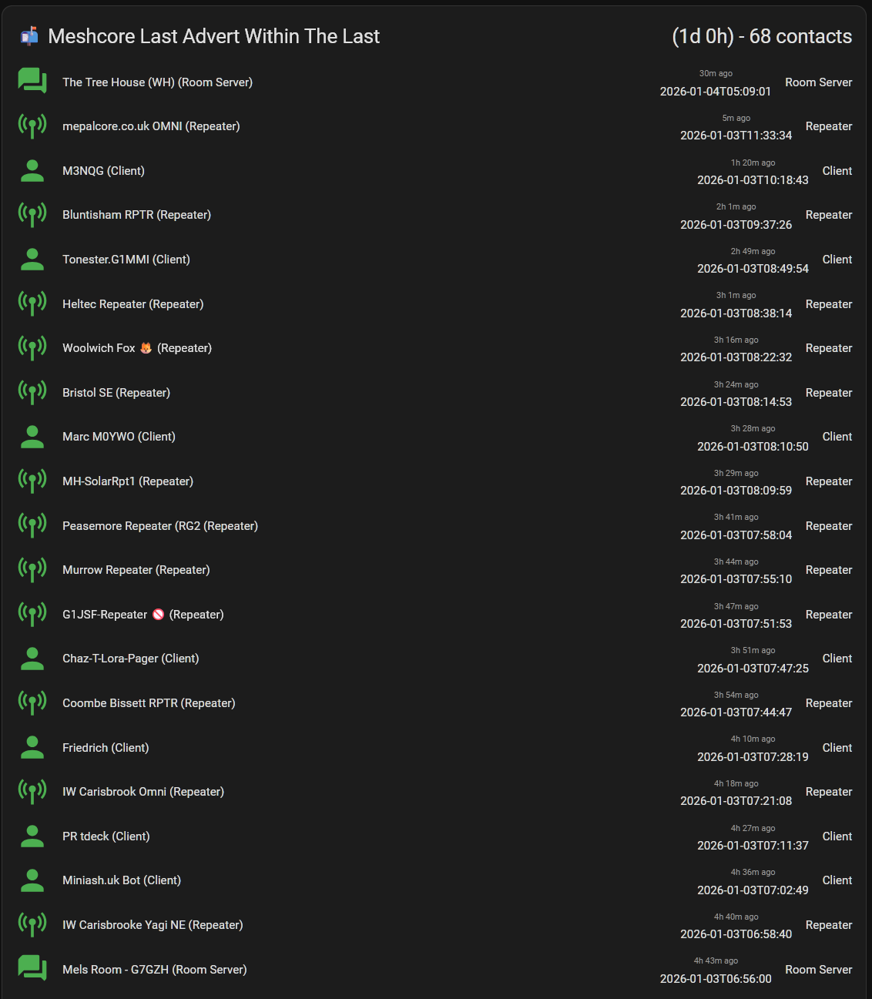
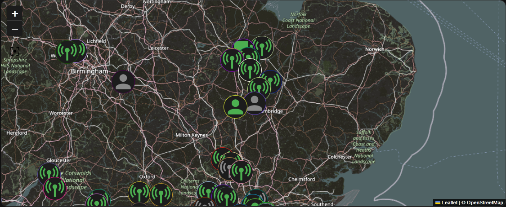

# MeshCore Home Assistant Panel

AppDaemon apps and dashboard cards for Home Assistant that enhance the MeshCore integration with:

- **Dynamic map visualisation** with time-based filtering
- **Real-time hop count and SNR tracking** from messages
- **Filterable contact lists** by node type and time threshold
- **Signal quality metrics** (RSSI, SNR) from mesh network paths

## Features

✅ Dynamic contact filtering by time threshold and node type  
✅ Live map visualization with automatic updates  
✅ Message hop tracking with signal quality (SNR/RSSI)  
✅ Clean, multi-column dashboard views  

## Screenshots

### Dynamic Contact List with Hops and SNR


### Live Map Visualization


### Filtered by Node Type


## Requirements

- Home Assistant with [MeshCore integration](https://github.com/meshcore-dev/meshcore-ha) installed
- AppDaemon add-on
- HACS Frontend cards:
  - [auto-entities](https://github.com/thomasloven/lovelace-auto-entities)
  - [config-template-card](https://github.com/iantrich/config-template-card)
  - [multiple-entity-row](https://github.com/benct/lovelace-multiple-entity-row)
  - [card-mod](https://github.com/thomasloven/lovelace-card-mod)
  - [ha-map-card](https://github.com/nathan-gs/ha-map-card)
  - [mushroom-cards](https://github.com/piitaya/lovelace-mushroom) (for input controls)

## Installation

### 1. Create Required Helpers

Go to **Settings → Devices & Services → Helpers** and create:

**Input Number - Threshold Hours**
- Name: `MeshCore Threshold Hours`
- Entity ID: `input_number.meshcore_threshold_hours`
- Minimum: `1`
- Maximum: `168` (7 days)
- Step: `1`
- Unit: `hours`
- Default: `12`

**Input Select - Node Type Filter**
- Name: `MeshCore Type`
- Entity ID: `input_select.meshcore_type`
- Options:
```
  All
  Client
  Repeater
  Room Server
```

### 2. Install AppDaemon Apps

[Continue with AppDaemon installation...]
