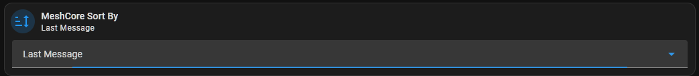
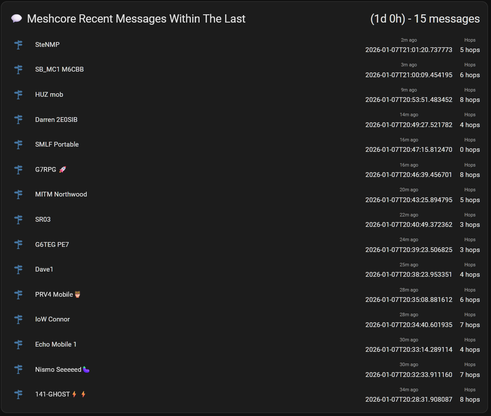

# MeshCore Home Assistant Panel

AppDaemon apps and dashboard cards for Home Assistant that enhance the MeshCore integration with:
- **Dynamic map visualisation** with time-based filtering
- **Real-time hop count and SNR tracking** from messages
- **Filterable contact lists** by node type and time threshold
- **Sortable views** by last advertisement or last message
- **Signal quality metrics** (RSSI, SNR) from mesh network paths

## Features

✅ Dynamic contact filtering by time threshold and node type  
✅ Sort contacts by last advertisement or last message  
✅ Live map visualization with automatic updates  
✅ Message hop tracking with signal quality (SNR/RSSI)  
✅ Multi-path reception tracking (see all routes a message took)  
✅ Clean, multi-column dashboard views  

## Screenshots

### Dynamic Contact List with Hops and SNR


### Live Map Visualization


### Filtered by Node Type


### Sort By Selection


### Recent Messages View


## Requirements

- Home Assistant with [MeshCore integration](https://github.com/meshcore-dev/meshcore-ha) installed
- AppDaemon add-on
- HACS Frontend cards:
  - [auto-entities](https://github.com/thomasloven/lovelace-auto-entities)
  - [config-template-card](https://github.com/iantrich/config-template-card)
  - [multiple-entity-row](https://github.com/benct/lovelace-multiple-entity-row)
  - [card-mod](https://github.com/thomasloven/lovelace-card-mod)
  - [ha-map-card](https://github.com/nathan-gs/ha-map-card)
  - [mushroom-cards](https://github.com/piitaya/lovelace-mushroom) (for input controls)

## Installation

### 1. Create Required Helpers

Go to **Settings → Devices & Services → Helpers** and create:

#### Input Number - Threshold Hours
- Name: `MeshCore Threshold Hours`
- Entity ID: `input_number.meshcore_threshold_hours`
- Minimum: `0.1` (allows filtering down to ~6 minutes)
- Maximum: `672` (28 days)
- Step: `0.5`
- Unit: `hours`
- Default: `12`

#### Input Select - Node Type Filter
- Name: `MeshCore Type`
- Entity ID: `input_select.meshcore_type`
- Options:
```
All
Client
Repeater
Room Server
```

#### Input Select - Sort By
- Name: `MeshCore Sort By`
- Entity ID: `input_select.meshcore_sort_by`
- Options:
```
Last Advert
Last Message
```

### 2. Install AppDaemon Apps

#### Finding Your AppDaemon Directory

The location depends on your installation method:

**Home Assistant OS / Supervised (AppDaemon add-on):**
```
/addon_configs/a0d7b954_appdaemon/apps/
```
Access via: `\\your-ha-ip\addon_configs\########_appdaemon\apps\`

**Docker / Manual Installation:**
```
/config/appdaemon/apps/
```
Access via: `\\your-ha-ip\config\appdaemon\apps\`

**To find your path:**
1. Install File Editor or Studio Code Server add-on
2. Look for existing AppDaemon files like `hello.py`
3. Note the directory path shown

#### Installation Steps

1. Copy the app files to your AppDaemon apps directory:
   - `meshcore_map.py`
   - `meshcore_hops.py`

2. Edit `apps.yaml` in the same directory and add:
```yaml
meshcore_map:
  module: meshcore_map
  class: MeshCoreMapEntities

meshcore_hops:
  module: meshcore_hops
  class: MeshCoreHops
```

3. Restart AppDaemon (Settings → Add-ons → AppDaemon → Restart)

4. Verify by checking AppDaemon logs for:
```
INFO AppDaemon: Calling initialize() for meshcore_map
INFO AppDaemon: Calling initialize() for meshcore_hops
INFO meshcore_map: MeshCoreMapEntities initialized
INFO meshcore_hops: MeshCoreHops initialized
INFO meshcore_hops: Name cache built with XXXX entries
```

5. Confirm sensors exist in Developer Tools → States:
   - `sensor.meshcore_map_entities`
   - `sensor.meshcore_hops_*` (created when messages are received)

### 3. Install Dashboard Cards

Copy the card configurations from the `dashboard/` folder to your Lovelace dashboard.

## How It Works

### meshcore_map.py
Creates a sensor (`sensor.meshcore_map_entities`) containing a filtered list of contacts for the map card. Updates automatically based on your threshold and node type settings.

### meshcore_hops.py
Listens to MeshCore raw events and creates sensors (`sensor.meshcore_hops_{pubkey}`) for each contact that sends a message. Tracks:
- **Hop count** - Number of hops the message took
- **SNR/RSSI** - Signal quality metrics
- **Multi-path receptions** - All routes a message took through the mesh
- **Location data** - Latitude/longitude from the contact sensor
- **Last message time** - For sorting by recent activity

## Sensor Attributes

### sensor.meshcore_hops_{pubkey}

| Attribute | Description |
|-----------|-------------|
| `sender_name` | Contact display name |
| `pubkey_prefix` | Contact's public key prefix |
| `latitude` | Contact's latitude (from advert) |
| `longitude` | Contact's longitude (from advert) |
| `path_length` | Best reception hop count |
| `snr` | Best reception SNR |
| `rssi` | Best reception RSSI |
| `max_hops` | Longest path observed |
| `longest_path` | Full route string for visualization |
| `receptions` | Array of all reception paths |
| `reception_count` | Number of paths captured |
| `last_message_time` | Unix timestamp |
| `last_message_formatted` | ISO formatted timestamp |
| `last_message_text` | First 100 chars of message |

## Troubleshooting

### No sensors appearing
- Check AppDaemon logs for errors
- Verify MeshCore integration is working and receiving messages
- Ensure `meshcore_raw_event` events are being fired (check Developer Tools → Events)

### "No pubkey found" warnings
This is normal for contacts not yet in your contact list. The script will use a name-based sensor ID instead.

### Sensors not updating
- Check that your MeshCore device is receiving messages
- Verify the threshold hours setting isn't filtering out recent activity

## License

MIT License - See LICENSE file for details.
